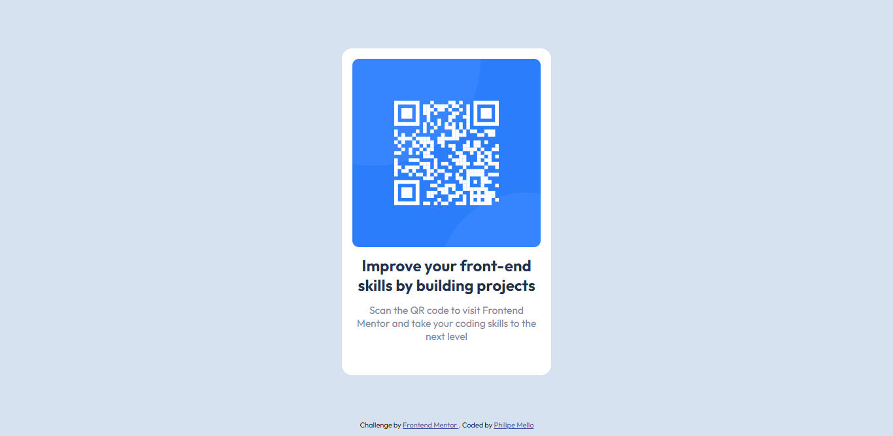

# Frontend Mentor - QR code component solution

This is a solution to the [QR code component challenge on Frontend Mentor](https://www.frontendmentor.io/challenges/qr-code-component-iux_sIO_H). Frontend Mentor challenges help you improve your coding skills by building realistic projects. 

## Table of contents

- [Overview](#overview)
  - [Screenshot](#screenshot)
  - [Links](#links)
- [My process](#my-process)
  - [Built with](#built-with)
- [Author](#author)

## Overview

### Screenshot

 - Desktop

 - Mobile

### Links

- Solution URL: [GitHub](https://github.com/Philipessj1/Qr-code-component)
- Live Site URL: [GitHub Pages](https://philipessj1.github.io/Qr-code-component/)

## My process

### Built with

- Semantic HTML5 markup
- CSS custom properties
- FlexBox
- Mobile-first workflow

## Author

- GitHub - [Philipe Mello](https://github.com/Philipessj1)
- Frontend Mentor - [@Philipessj1](https://www.frontendmentor.io/profile/Philipessj1)